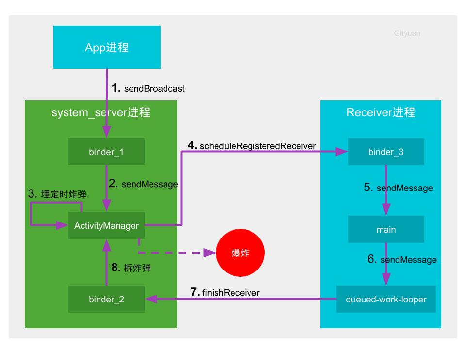
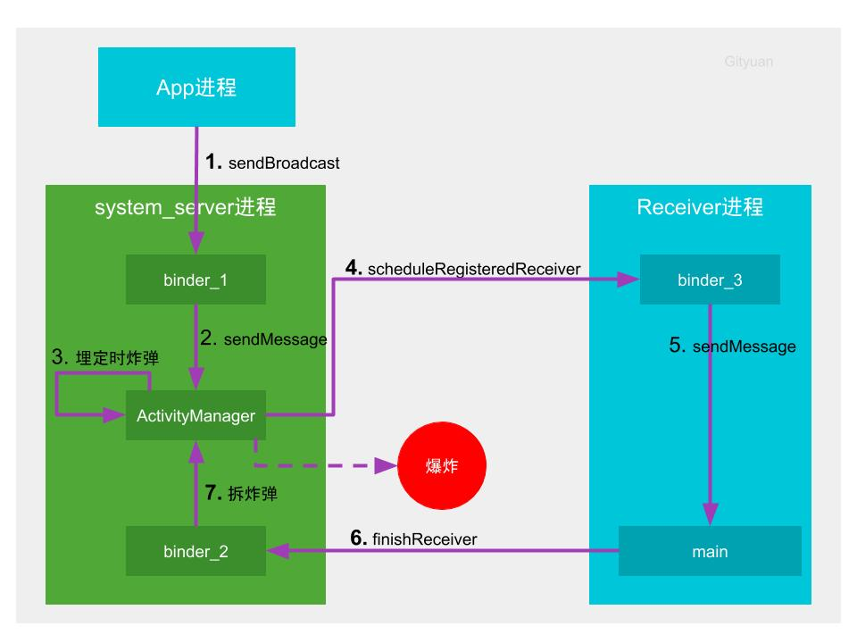
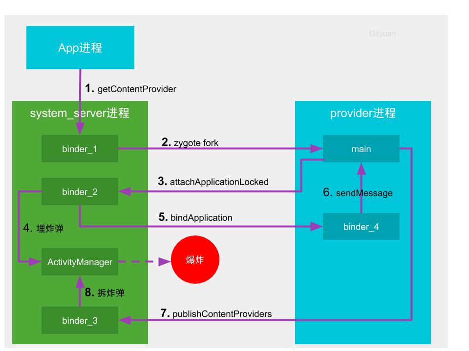
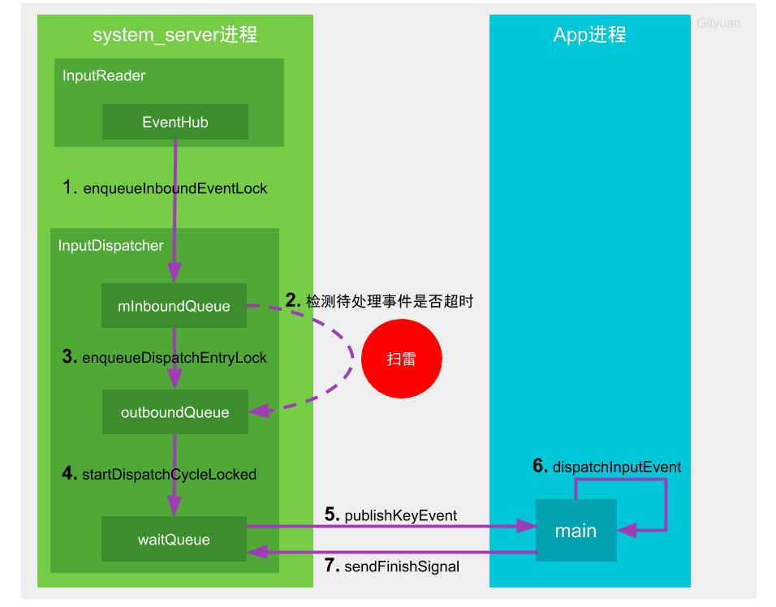

### 1. 概述

ANR全称`Application Not Responding`，即应用未响应。简单来说就是主线程在特定的时间内没有做完特定的事情。

##### ANR 类型

- Input事件（包括按键和触摸事件）超过5s没有被处理完
- Service处理超时，前台20s，后台200s
- BroadcastReceiver处理超时，前台10s，后台60s
- ContentProvider执行超时，10s内没有处理完

### 2. ANR 分析

##### ANR 产生原因

- 主线程有耗时操作，如有复杂的layout布局，IO操作等
- 主线程被子线程同步锁block
- 主线程被Binder对端block
- Binder被占满导致主线程无法和SystemServer通信
- 得不到系统资源（CPU/RAM/IO）

##### ANR 日志

发生ANR的过程中，系统会自动的获取并打印日志信息，从这些log中我们可以获取ANR的类型，CPU的情况（CPU使用率过高有可能是CPU饥饿导致了ANR；CPU使用率过低说明主线程被block了），每种ANR类型在规定时间内执行的具体操作等等。

- 发生KeyDispatchTimeout类型的ANR日志中出现的关键字：Reason: Input dispatching timed out xxxx
- 发生ServiceTimeout类型的ANR日志中出现的关键字：Timeout executing service:/executing serviceXXX
- 发生BroadcastTimeout类型的ANR日志中出现的关键字：Timeout of broadcast XXX/Receiver during timeout:XXX/Broadcast of XXX
- 发生ProcessContentProviderPublishTimedOutLocked类型的ANR日志中出现的关键字：timeout publishing content providers

log输出以外，你会发现各个应用进程和系统进程的函数堆栈信息都输出到了一个/data/anr/traces.txt的文件中，这个文件是分析ANR原因的关键文件。

##### ANR 分析

分析ANR大致分为以下几个步骤:

1. 确定ANR发生时间,关键字:**am_anr**,**ANR in**
2. 查看ANR发生时打印的trace,文件目录:**/data/anr/traces.txt**
3. 查看系统耗时关键字:**binder_sample**,**dvm_lock_sample**,**am_lifecycle_sample**,**binder thread**
4. 结合源码和以上的信息进行分析

### 3. ANR 避免

为了避免 ANR 发生的概率，基本的思路就是将IO操作在工作线程来处理，减少其他耗时操作和错误操作

1：UI线程尽量只做跟UI相关的工作
2：耗时的工作（比如数据库操作，I/O，连接网络或 者别的有可能阻碍UI线程的操作） 把它放入单独的线程处理
3：尽量用Handler来处理UIthread和别的thread之间的交互

### 4. ANR 原理

ANR是一套监控Android应用响应是否及时的机制，可以把发生ANR比作是引爆炸弹，那么整个流程包含三部分组成：

1. 埋定时炸弹：中控系统(system_server进程)启动倒计时，在规定时间内如果目标(应用进程)没有干完所有的活，则中控系统会定向炸毁(杀进程)目标。
2. 拆炸弹：在规定的时间内干完工地的所有活，并及时向中控系统报告完成，请求解除定时炸弹，则幸免于难。
3. 引爆炸弹：中控系统立即封装现场，抓取快照，搜集目标执行慢的罪证(traces)，便于后续的案件侦破(调试分析)，最后是炸毁目标。

#### service 超时机制

下面来看看埋炸弹与拆炸弹在整个服务启动(startService)过程所处的环节。

图解1：

1. 客户端(App进程)向中控系统(system_server进程)发起启动服务的请求
2. 中控系统派出一名空闲的通信员(binder_1线程)接收该请求，紧接着向组件管家(ActivityManager线程)发送消息，埋下定时炸弹
3. 通讯员1号(binder_1)通知工地(service所在进程)的通信员准备开始干活
4. 通讯员3号(binder_3)收到任务后转交给包工头(main主线程)，加入包工头的任务队列(MessageQueue)
5. 包工头经过一番努力干完活(完成service启动的生命周期)，然后等待SharedPreferences(简称SP)的持久化；
6. 包工头在SP执行完成后，立刻向中控系统汇报工作已完成
7. 中控系统的通讯员2号(binder_2)收到包工头的完工汇报后，立刻拆除炸弹。如果在炸弹倒计时结束前拆除炸弹则相安无事，否则会引发爆炸(触发ANR)

#### broadcast 超时机制

broadcast跟service超时机制大抵相同，对于静态注册的广播在超时检测过程需要检测SP，如下图所示。

图解2：

1. 客户端(App进程)向中控系统(system_server进程)发起发送广播的请求
2. 中控系统派出一名空闲的通信员(binder_1)接收该请求转交给组件管家(ActivityManager线程)
3. 组件管家执行任务(processNextBroadcast方法)的过程埋下定时炸弹
4. 组件管家通知工地(receiver所在进程)的通信员准备开始干活
5. 通讯员3号(binder_3)收到任务后转交给包工头(main主线程)，加入包工头的任务队列(MessageQueue)
6. 包工头经过一番努力干完活(完成receiver启动的生命周期)，发现当前进程还有SP正在执行写入文件的操作，便将向中控系统汇报的任务交给SP工人(queued-work-looper线程)
7. SP工人历经艰辛终于完成SP数据的持久化工作，便可以向中控系统汇报工作完成
8. 中控系统的通讯员2号(binder_2)收到包工头的完工汇报后，立刻拆除炸弹。如果在倒计时结束前拆除炸弹则相安无事，否则会引发爆炸(触发ANR)

（说明：SP从8.0开始采用名叫“queued-work-looper”的handler线程，在老版本采用newSingleThreadExecutor创建的单线程的线程池）

如果是动态广播，或者静态广播没有正在执行持久化操作的SP任务，则不需要经过“queued-work-looper”线程中转，而是直接向中控系统汇报，流程更为简单，如下图所示：

可见，只有XML静态注册的广播超时检测过程会考虑是否有SP尚未完成，动态广播并不受其影响。

#### provider 超时机制

provider的超时是在provider进程首次启动的时候才会检测，当provider进程已启动的场景，再次请求provider并不会触发provider超时。

图解3：

1. 客户端(App进程)向中控系统(system_server进程)发起获取内容提供者的请求
2. 中控系统派出一名空闲的通信员(binder_1)接收该请求，检测到内容提供者尚未启动，则先通过zygote孵化新进程
3. 新孵化的provider进程向中控系统注册自己的存在
4. 中控系统的通信员2号接收到该信息后，向组件管家(ActivityManager线程)发送消息，埋下炸弹
5. 通信员2号通知工地(provider进程)的通信员准备开始干活
6. 通讯员4号(binder_4)收到任务后转交给包工头(main主线程)，加入包工头的任务队列(MessageQueue)
7. 包工头经过一番努力干完活(完成provider的安装工作)后向中控系统汇报工作已完成
8. 中控系统的通讯员3号(binder_3)收到包工头的完工汇报后，立刻拆除炸弹。如果在倒计时结束前拆除炸弹则相安无事，否则会引发爆炸(触发ANR)

#### input 超时机制

input的超时检测机制跟service、broadcast、provider截然不同，为了更好的理解input过程先来介绍两个重要线程的相关工作：

- InputReader线程负责通过EventHub(监听目录/dev/input)读取输入事件，一旦监听到输入事件则放入到InputDispatcher的mInBoundQueue队列，并通知其处理该事件；

- InputDispatcher线程负责将接收到的输入事件分发给目标应用窗口，分发过程使用到3个事件队列：

  - mInBoundQueue用于记录InputReader发送过来的输入事件；
  - outBoundQueue用于记录即将分发给目标应用窗口的输入事件；
  - waitQueue用于记录已分发给目标应用，且应用尚未处理完成的输入事件；

  input的超时机制并非时间到了一定就会爆炸，而是处理后续上报事件的过程才会去检测是否该爆炸，所以更像是扫雷的过程

图解4：

1. InputReader线程通过EventHub监听底层上报的输入事件，一旦收到输入事件则将其放至mInBoundQueue队列，并唤醒InputDispatcher线程
2. InputDispatcher开始分发输入事件，设置埋雷的起点时间。先检测是否有正在处理的事件(mPendingEvent)，如果没有则取出mInBoundQueue队头的事件，并将其赋值给mPendingEvent，且重置ANR的timeout；否则不会从mInBoundQueue中取出事件，也不会重置timeout。然后检查窗口是否就绪(checkWindowReadyForMoreInputLocked)，满足以下任一情况，则会进入扫雷状态(检测前一个正在处理的事件是否超时)，终止本轮事件分发，否则继续执行步骤3。
   - 对于按键类型的输入事件，则outboundQueue或者waitQueue不为空，
   - 对于非按键的输入事件，则waitQueue不为空，且等待队头时间超时500ms
3. 当应用窗口准备就绪，则将mPendingEvent转移到outBoundQueue队列
4. 当outBoundQueue不为空，且应用管道对端连接状态正常，则将数据从outboundQueue中取出事件，放入waitQueue队列
5. InputDispatcher通过socket告知目标应用所在进程可以准备开始干活
6. App在初始化时默认已创建跟中控系统双向通信的socketpair，此时App的包工头(main线程)收到输入事件后，会层层转发到目标窗口来处理
7. 包工头完成工作后，会通过socket向中控系统汇报工作完成，则中控系统会将该事件从waitQueue队列中移除。

input超时机制为什么是扫雷，而非定时爆炸呢？是由于对于input来说即便某次事件执行时间超过timeout时长，只要用户后续在没有再生成输入事件，则不会触发ANR。 这里的扫雷是指当前输入系统中正在处理着某个耗时事件的前提下，后续的每一次input事件都会检测前一个正在处理的事件是否超时（进入扫雷状态），检测当前的时间距离上次输入事件分发时间点是否超过timeout时长。如果前一个输入事件，则会重置ANR的timeout，从而不会爆炸。

#### ANR 爆炸现场

对于service、broadcast、provider、input发生ANR后，中控系统会马上去抓取现场的信息，用于调试分析。收集的信息包括如下：

- 将am_anr信息输出到EventLog，也就是说ANR触发的时间点最接近的就是EventLog中输出的am_anr信息
- 收集以下重要进程的各个线程调用栈trace信息，保存在data/anr/traces.txt文件
  - 当前发生ANR的进程，system_server进程以及所有persistent进程
  - audioserver, cameraserver, mediaserver, surfaceflinger等重要的native进程
  - CPU使用率排名前5的进程
- 将发生ANR的reason以及CPU使用情况信息输出到main log
- 将traces文件和CPU使用情况信息保存到dropbox，即data/system/dropbox目录
- 对用户可感知的进程则弹出ANR对话框告知用户，对用户不可感知的进程发生ANR则直接杀掉

作为应用开发者应让主线程尽量只做UI相关的操作，避免耗时操作，比如过度复杂的UI绘制，网络操作，文件IO操作；避免主线程跟工作线程发生锁的竞争，减少系统耗时binder的调用，谨慎使用sharePreference，注意主线程执行provider query操作。简而言之，尽可能减少主线程的负载，让其空闲待命，以期可随时响应用户的操作。

#### 有哪些路径会引发ANR

答案是从埋下定时炸弹到拆炸弹之间的任何一个或多个路径执行慢都会导致ANR（以service为例），可以是service的生命周期的回调方法(比如onStartCommand)执行慢，可以是主线程的消息队列存在其他耗时消息让service回调方法迟迟得不到执行，可以是SP操作执行慢，可以是system_server进程的binder线程繁忙而导致没有及时收到拆炸弹的指令。另外ActivityManager线程也可能阻塞，出现的现象就是前台服务执行时间有可能超过10s，但并不会出现ANR。

发生ANR时从trace来看主线程却处于空闲状态或者停留在非耗时代码的原因有哪些？可以是抓取trace过于耗时而错过现场，可以是主线程消息队列堆积大量消息而最后抓取快照一刻只是瞬时状态，可以是广播的“queued-work-looper”一直在处理SP操作。

