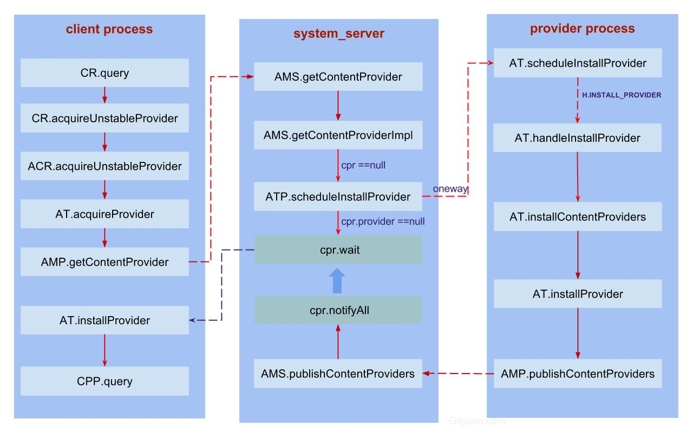

## Android ContentProvider

### URI

- 定义：`Uniform Resource Identifier`，即统一资源标识符
- 作用：唯一标识 `ContentProvider` & 其中的数据


### ContentProvider

#### 为什么设计 ContentProvider

- 隐藏数据的实现方式，对外提供统一的数据访问接口，使用者完全不用关心数据的实现细节与获取方式。
- 更好的数据访问权限管理。 `ContentProvider` 可以对开发的数据进行权限设置，不同的 `URI` 可以对应不同的权限，只有符合权限要求的组件才能访问到 `ContentProvider` 的具体操作。
- `ContentProvider` 封装了跨进程共享的逻辑，我们只需要 `Uri` 即可访问数据。由系统来管理 `ContentProvider` 的创建、生命周期及访问的线程分配，简化我们在应用间共享数据（ 进程间通信 ）的方式。我们只管通过 `ContentResolver` 访问 `ContentProvider` 所提示的数据接口，而不需要担心它所在进程是启动还是未启动。

进程间共享数据的本质是：添加、删除、获取 & 修改（更新）数据，所以`ContentProvider`的核心方法也主要是上述4个作用。

```java
<-- 4个核心方法 -->
  public Uri insert(Uri uri, ContentValues values) 
  // 外部进程向 ContentProvider 中添加数据

  public int delete(Uri uri, String selection, String[] selectionArgs) 
  // 外部进程 删除 ContentProvider 中的数据

  public int update(Uri uri, ContentValues values, String selection, String[] selectionArgs)
  // 外部进程更新 ContentProvider 中的数据

  public Cursor query(Uri uri, String[] projection, String selection, String[] selectionArgs,  String sortOrder)　 
  // 外部应用 获取 ContentProvider 中的数据

// 注：
  // 1. 上述4个方法由外部进程回调，并运行在ContentProvider进程的Binder线程池中（不是主线程）
 // 2. 存在多线程并发访问，需要实现线程同步
   // a. 若ContentProvider的数据存储方式是使用SQLite & 一个，则不需要，因为SQLite内部实现好了线程同步，若是多个SQLite则需要，因为SQL对象之间无法进行线程同步
  // b. 若ContentProvider的数据存储方式是内存，则需要自己实现线程同步

<-- 2个其他方法 -->
public boolean onCreate() 
// ContentProvider创建后 或 打开系统后其它进程第一次访问该ContentProvider时 由系统进行调用
// 注：运行在ContentProvider进程的主线程，故不能做耗时操作

public String getType(Uri uri)
// 得到数据类型，即返回当前 Url 所代表数据的MIME类型
```

#### 权限控制

- `android:exported` ，这个属性用于指示该服务是否能够被其他应用程序组件调用。如果设置为 `true` ，则能够被调用或交互，否则不能。设置为 `false` 时，只有同一个应用程序的组件或带有相同用户 `ID` 的应用程序才能启动或绑定该服务。
- 对于需要开放的组件应设置合理的权限，如果只需要对同一个签名的其它应用开放 `ContentProvider` ，则可以设置 `signature` 级别的权限。

### ContentResolver

统一管理不同 `ContentProvider`间的操作，外部进程通过 `ContentResolver`类 从而与`ContentProvider`类进行交互。

`ContentResolver` 类提供了与`ContentProvider`类相同名字 & 作用的4个方法

```java
// 外部进程向 ContentProvider 中添加数据
public Uri insert(Uri uri, ContentValues values)　 

// 外部进程 删除 ContentProvider 中的数据
public int delete(Uri uri, String selection, String[] selectionArgs)

// 外部进程更新 ContentProvider 中的数据
public int update(Uri uri, ContentValues values, String selection, String[] selectionArgs)　 

// 外部应用 获取 ContentProvider 中的数据
public Cursor query(Uri uri, String[] projection, String selection, String[] selectionArgs, String sortOrder)
```

### 工具类

#### ContentUris

操作 `URI`，核心方法有两个：`withAppendedId（）` &`parseId（）`

```java
// withAppendedId（）作用：向URI追加一个id
Uri uri = Uri.parse("content://cn.scu.myprovider/user") 
Uri resultUri = ContentUris.withAppendedId(uri, 7);  
// 最终生成后的Uri为：content://cn.scu.myprovider/user/7

// parseId（）作用：从URL中获取ID
Uri uri = Uri.parse("content://cn.scu.myprovider/user/7") 
long personid = ContentUris.parseId(uri); 
//获取的结果为:7
```

#### UriMatcher

在`ContentProvider` 中注册`URI`，根据 `URI` 匹配 `ContentProvider` 中对应的数据表

```java
// 步骤1：初始化UriMatcher对象
    UriMatcher matcher = new UriMatcher(UriMatcher.NO_MATCH); 
    //常量UriMatcher.NO_MATCH  = 不匹配任何路径的返回码
    // 即初始化时不匹配任何东西

// 步骤2：在ContentProvider 中注册URI（addURI（））
    int URI_CODE_a = 1；
    int URI_CODE_b = 2；
    matcher.addURI("cn.scu.myprovider", "user1", URI_CODE_a); 
    matcher.addURI("cn.scu.myprovider", "user2", URI_CODE_b); 
    // 若URI资源路径 = content://cn.scu.myprovider/user1 ，则返回注册码URI_CODE_a
    // 若URI资源路径 = content://cn.scu.myprovider/user2 ，则返回注册码URI_CODE_b

// 步骤3：根据URI 匹配 URI_CODE，从而匹配ContentProvider中相应的资源（match（））

@Override   
    public String getType(Uri uri) {   
      Uri uri = Uri.parse(" content://cn.scu.myprovider/user1");   

      switch(matcher.match(uri)){   
     // 根据URI匹配的返回码是URI_CODE_a
     // 即matcher.match(uri) == URI_CODE_a
      case URI_CODE_a:   
        return tableNameUser1;   
        // 如果根据URI匹配的返回码是URI_CODE_a，则返回ContentProvider中的名为tableNameUser1的表
      case URI_CODE_b:   
        return tableNameUser2;
        // 如果根据URI匹配的返回码是URI_CODE_b，则返回ContentProvider中的名为tableNameUser2的表
    }   
}
```

#### ContentObserver

观察 `Uri`引起 `ContentProvider` 中的数据变化 & 通知外界（即访问该数据访问者），当`ContentProvider` 中的数据发生变化（增、删 & 改）时，就会触发该 `ContentObserver`类

```java
// 步骤1：注册内容观察者ContentObserver
    getContentResolver().registerContentObserver（uri）；
    // 通过ContentResolver类进行注册，并指定需要观察的URI

// 步骤2：当该URI的ContentProvider数据发生变化时，通知外界（即访问该ContentProvider数据的访问者）
    public class UserContentProvider extends ContentProvider { 
      public Uri insert(Uri uri, ContentValues values) { 
      db.insert("user", "userid", values); 
      getContext().getContentResolver().notifyChange(uri, null); 
      // 通知访问者
   } 
}

// 步骤3：解除观察者
 getContentResolver().unregisterContentObserver（uri）；
    // 同样需要通过ContentResolver类进行解除
```

### 原理

1. ContentProvider是通过IBinder实现通信过程的
2. getContentResolver获得到的是ApplicationContentResolver（在ContextImpt中实现的）
3. Client端ApplicationContentResolver使用ContentProviderProxy作为IBinder的Proxy（ContentProviderNative中实现）
4. Provider端通过Transport作为IBinder的实现端（ContentProvider中实现）

##### getContentResolver -> ApplicationContentResolver -> ContentProviderProxy <===IBidner====> Transport -> NameProvider

先获取provider,然后安装provider信息,最后便是真正的查询操作.

- 场景一（进程不存在）

  Provider进程不存在: 当provider进程不存在时,先创建进程并publish相关的provider

  

  图解:

  1. client进程：通过binder(调用AMS.getContentProviderImpl)向system_server进程请求相应的provider；
  2. system进程：如果目标provider所对应的进程尚未启动，system_server会调用startProcessLocked来启动provider进程； 当进程启动完成，此时cpr.provider ==null，则system_server便会进入wait()状态，等待目标provider发布；
  3. provider进程：进程启动后执行完attch到system_server，紧接着执行bindApplication；在这个过程会installProvider以及 publishContentProviders；再binder call到system_server进程；
  4. system进程：再回到system_server，发布provider信息，并且通过notify机制，唤醒前面处于wait状态的binder线程；并将 getContentProvider的结果返回给client进程；
  5. client进程：接着执行installProvider操作，安装provider的(包含对象记录,引用计数维护等工作)；

- 场景二（进程已存在）

  provider未发布: 请求provider时,provider进程存在但provide的记录对象cpr ==null,这时的流程如下:

  

  1. Client进程在获取provider的过程,发现cpr为空,则调用scheduleInstallProvider来向provider所在进程发出一个oneway的binder请求,并进入wait()状态.

  2. provider进程安装完provider信息,则notifyAll()处于等待状态的进程/线程;

  如果provider在publish完成之后, 这时再次请求该provider,那就便没有的最右侧的这个过程,直接在AMS.getContentProviderImpl之后便进入AT.installProvider的过程,而不会再次进入wait()过程.

#### 引用计数

关于provider分为stable provider和unstable provider，在于引用计数的不同，一句话来说就是stable provider建立的是强连接, 客户端进程的与provider进程是存在依赖关系, 即provider进程死亡则会导致客户端进程被杀。

当Client进程存在对某个provider的引用时,则会根据provider类型进行不同的处理:

- 对于stable provider: 会杀掉所有跟该provider建立stable连接的非persistent进程.
- 对于unstable provider: 不会导致client进程被级联所杀,只会回调unstableProviderDied来清理相关信息.

#### onCreate()

ContentProvider 的 onCreate() 在 Application 的 onCreate() 之前执行

ActivityThread -> handleBindApplication -> bindApplication -> installProviders -> localProvider.attachInfo -> provider. onCreate

### 源码分析

ContentResolver

- 分析 1

```java
// query()
IContentProvider unstableProvider = acquireUnstableProvider(uri);
// insert()/delete()/update()/call()
IContentProvider provider = acquireProvider(uri);
```

- 分析 2

```java
		/**
     * Returns the content provider for the given content URI.
     *
     * @param uri The URI to a content provider
     * @return The ContentProvider for the given URI, or null if no content provider is found.
     * @hide
     */
    public final IContentProvider acquireProvider(Uri uri) {
        if (!SCHEME_CONTENT.equals(uri.getScheme())) {
            return null;
        }
        final String auth = uri.getAuthority();
        if (auth != null) {
            // 源码分析 4
            return acquireProvider(mContext, auth);
        }
        return null;
    }
```

- 分析 3

```java
    // 抽象方法，其具体实现是 ContextImpl 的内部类 ApplicationContentResolver
    protected abstract IContentProvider acquireProvider(Context c, String name);
```

ContextImpl.ApplicationContentResolver

```java
        @Override
        protected IContentProvider acquireProvider(Context context, String auth) {
            return mMainThread.acquireProvider(context,
                    ContentProvider.getAuthorityWithoutUserId(auth),
                    resolveUserIdFromAuthority(auth), true);
        }
				
				// mMainThread 是类中的成员变量，在构造方法中传入
				private final ActivityThread mMainThread;
				public ApplicationContentResolver(Context context, ActivityThread mainThread) {
            super(context);
            mMainThread = Preconditions.checkNotNull(mainThread);
        }
```

ContextImpl

```java
// ContextImpl 中的成员变量
private final ApplicationContentResolver mContentResolver;
// 在构造方法中初始化
mContentResolver = new ApplicationContentResolver(this, mainThread);
```

- 分析 4

ActivityThread

```java
    public final IContentProvider acquireProvider(
            Context c, String auth, int userId, boolean stable) {
        // 如果 Provider 已经存在，则直接返回
        final IContentProvider provider = acquireExistingProvider(c, auth, userId, stable);
        if (provider != null) {
            return provider;
        }

        // There is a possible race here.  Another thread may try to acquire
        // the same provider at the same time.  When this happens, we want to ensure
        // that the first one wins.
        // Note that we cannot hold the lock while acquiring and installing the
        // provider since it might take a long time to run and it could also potentially
        // be re-entrant in the case where the provider is in the same process.
        ContentProviderHolder holder = null;
        try {
            synchronized (getGetProviderLock(auth, userId)) {
                holder = ActivityManager.getService().getContentProvider(
                        getApplicationThread(), auth, userId, stable);
            }
        } catch (RemoteException ex) {
            throw ex.rethrowFromSystemServer();
        }
        if (holder == null) {
            Slog.e(TAG, "Failed to find provider info for " + auth);
            return null;
        }

        // Install provider will increment the reference count for us, and break
        // any ties in the race.
        holder = installProvider(c, holder, holder.info,
                true /*noisy*/, holder.noReleaseNeeded, stable);
        return holder.provider;
    }
```


