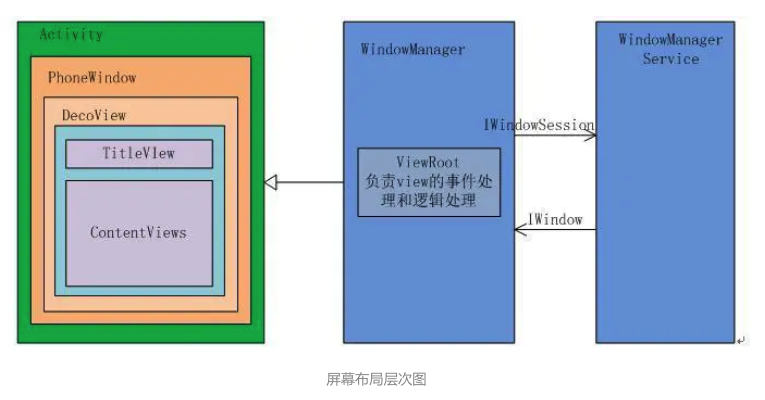
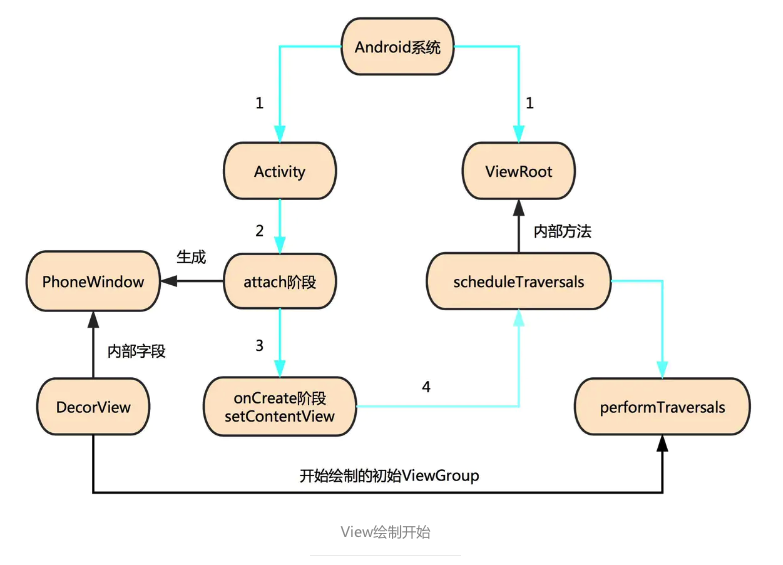
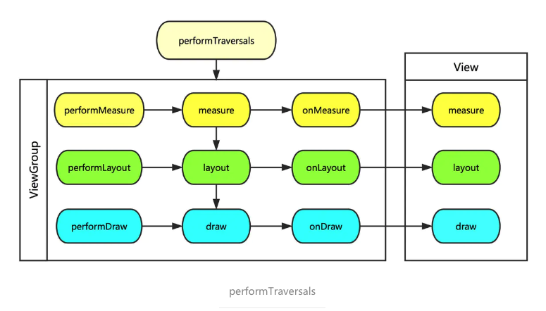

## View 绘制流程

### View 相关概念



- PhoneWindow：继承自Window类，负责管理界面显示以及事件响应，每个Activity 界面都包含一个PhoneWindow对象，它是Activity和整个View系统交互的接口。

- DecorView：是PhoneWindow中的起始节点View，继承自View类，是作为整个视图容器来使用的，主要负责设置窗口属性。

- ViewRoot：在系统启动一个Activty组件的同时将其创建，类似于MVC模型中的Controller，负责管理、布局和渲染窗口UI等事务。

### View 绘制开始



1. 系统启动一个Activity的同时创建一个ViewRoot实例。

2. Activity 在attach阶段生成一个PhoneWindow对象，它包含一个DecorView对象。

3. 在Activity执行onCreate中的setContentView之后，将读入的view加载进入第一张图的ContentViews区域。

4. 加载完毕后触发ViewRoot中的scheduleTraversals异步函数，从而进入ViewRoot的performTraversals函数，View的绘制从这里开始。

### performTraversals()



ViewRoot中的performTraversals方法以DecorView为父容器(ViewGroup)开始自上而下的View工作流程。

View的工作流程主要是指measure、layout、draw这三大流程，即测量、布局和绘制，其中measure确定View的测量宽和高，layout确定View的最终宽/高和四个顶点位置，而draw则将View绘制到屏幕上。

performTraversals会依次调用performMeasure、performLayout和performDraw三个方法，这三个方法分别完成顶级View的measure、layout和draw这三大流程。其中performMeasure中会调用measure方法，在measure方法中又会调用onMeasure方法，在onMeasure方法中则会对所有子元素进行measure过程，这样就完成了一次measure过程；子元素会重复父容器的measure过程，如此反复完成了整个View数的遍历。

#### measure

##### MeasureSpec

MeasureSpec，它用来把测量要求从父View传递给子View，我们知道View的大小最终由子View的LayoutParams与父View的测量要求公共决定，测量要求指的 就是这个MeasureSpec，它是一个32位int值。

高2位：SpecMode，测量模式 

低30位：SpecSize，在特定测量模式下的大小

```java
 				private static final int MODE_SHIFT = 30;
        private static final int MODE_MASK  = 0x3 << MODE_SHIFT;

        /** @hide */
        @IntDef({UNSPECIFIED, EXACTLY, AT_MOST})
        @Retention(RetentionPolicy.SOURCE)
        public @interface MeasureSpecMode {}

        /**  
         * 父View不对子View做任何限制，需要多大给多大，这种情况一般用于系统内部，表示一种测量的状态
         * Measure specification mode: The parent has not imposed any constraint
         * on the child. It can be whatever size it wants.
         */
        public static final int UNSPECIFIED = 0 << MODE_SHIFT;

        /**
         *父View已经检测出View所需要的精确大小，这个时候View的最终大小就是SpecSize所指定的值，它对应LayoutParams中的match_parent和具体数值这两种模式
         * Measure specification mode: The parent has determined an exact size
         * for the child. The child is going to be given those bounds regardless
         * of how big it wants to be.
         */
        public static final int EXACTLY     = 1 << MODE_SHIFT;

        /**
         *父View给子VIew提供一个最大可用的大小，子View去自适应这个大小
         * Measure specification mode: The child can be as large as it wants up
         * to the specified size.
         */
        public static final int AT_MOST     = 2 << MODE_SHIFT;
```

##### measure 流程

View的measure（）方法是一个final修饰的，意味着我们不能够重写他，最终它会调用onMeasure()方法进行真正的测量，测量原则就是循环遍历子类，遍历每一个子节点对View进行测量，直到最后一个View为止。

ViewGroup和View的测量有点不同：

1. View：View 在 onMeasure() 中会计算出自己的尺寸然后保存；
2. ViewGroup：ViewGroup在onMeasure()中会调用所有子View的measure()让它们进行自我测量，并根据子View计算出的期望尺寸来计算出它们的实际尺寸和位置然后保存。同时，它也会 根据子View的尺寸和位置来计算出自己的尺寸然后保存.

这里需要清楚的是ViewGroup 类并没有实现onMeasure，因为都是在它的子类实现了，不同的布局有不同的测量方法。我们知道测量过程其实都是在onMeasure方法里面做的。

#### Layout

layout的主要作用 ：根据子视图的大小以及布局参数将View树放到合适的位置上。

https://juejin.im/entry/5a9a61e4f265da23945eeee1


