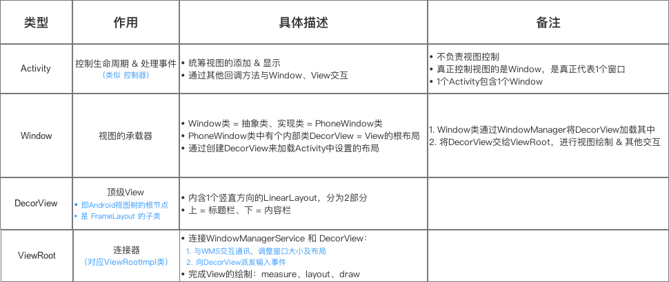
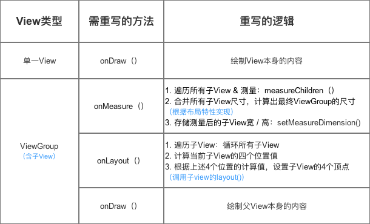

### Android View

#### View 的布局加载

要了解 android 中 View 的原理，要先从 LayoutInflater 入手。

获取 LayoutInflater 的实例有两种方法：

```java
LayoutInflater layoutInflater = LayoutInflater.from(context); 
```

```java
LayoutInflater layoutInflater = (LayoutInflater) context  
        .getSystemService(Context.LAYOUT_INFLATER_SERVICE);  
```

得到了实例后，就可以调用 inflate() 方法来加载布局了：

```java
layoutInflater.inflate(resourceId, root);  
```

分析 inflate() 的源码，可以看到LayoutInflater其实就是使用Android提供的pull解析方式来解析布局文件的。解析布局文件时，最外一层的属性是不生效的。

在setContentView()方法中，Android会自动在布局文件的最外层再嵌套一个FrameLayout，所以layout_width和layout_height属性才会有效果。

任何一个Activity中显示的界面其实主要都由两部分组成，标题栏和内容布局。


#### Activity 与 View 之间的关系

- 简介



Activity就像个控制器，不负责视图部分。Window像个承载器，装着内部视图。DecorView就是个顶层视图，是所有View的最外层布局。ViewRoot像个连接器，负责沟通，通过硬件的感知来通知视图，进行用户之间的交互。

- 流程


当用户点击屏幕产生一个触摸行为，这个触摸行为则是通过底层硬件来传递捕获，然后交给ViewRootImpl，接着将事件传递给DecorView，而DecorView再交给PhoneWindow，PhoneWindow再交给Activity，然后接下来就是我们常见的View事件分发了。

**硬件 -> ViewRootImpl -> DecorView -> PhoneWindow -> Activity**

- 层级


#### View 的绘制流程

每一个视图的绘制过程都必须经历三个最主要的阶段，即onMeasure()、onLayout()和onDraw()。

- onMeasure()

此方法是用于测量视图的大小的，View系统的绘制流程会从ViewRoot的performTraversals()方法中开始，在其内部调用View的measure()方法。measure()方法接收两个参数，widthMeasureSpec和heightMeasureSpec，这两个值分别用于确定视图的宽度和高度的规格和大小。

- onLayout()

这个方法是用于给视图进行布局的，也就是确定视图的位置。ViewRoot的performTraversals()方法会在measure结束后继续执行，并调用View的layout()方法来执行此过程。

- onDraw()

这里才真正地开始对视图进行绘制。ViewRoot中的代码会继续执行并创建出一个Canvas对象，然后调用View的draw()方法来执行具体的绘制工作。


##### getMeasuredWidth() 与 getWidth() 区别


#### 自定义 View

自定义View的实现方式大概可以分为三种，自绘控件、组合控件、以及继承控件。

- 自绘控件

自绘控件的意思就是，这个View上所展现的内容全部都是我们自己绘制出来的。绘制的代码是写在onDraw()方法中的。下面是一个自定义计数器的代码：

```java
public class CounterView extends View implements OnClickListener {  
  
    private Paint mPaint;  
      
    private Rect mBounds;  
  
    private int mCount;  
      
    public CounterView(Context context, AttributeSet attrs) {  
        super(context, attrs);  
        mPaint = new Paint(Paint.ANTI_ALIAS_FLAG);  
        mBounds = new Rect();  
        setOnClickListener(this);  
    }  
  
    @Override  
    protected void onDraw(Canvas canvas) {  
        super.onDraw(canvas);  
        mPaint.setColor(Color.BLUE);  
        canvas.drawRect(0, 0, getWidth(), getHeight(), mPaint);  
        mPaint.setColor(Color.YELLOW);  
        mPaint.setTextSize(30);  
        String text = String.valueOf(mCount);  
        mPaint.getTextBounds(text, 0, text.length(), mBounds);  
        float textWidth = mBounds.width();  
        float textHeight = mBounds.height();  
        canvas.drawText(text, getWidth() / 2 - textWidth / 2, getHeight() / 2  
                + textHeight / 2, mPaint);  
    }  
  
    @Override  
    public void onClick(View v) {  
        mCount++;  
        invalidate();  // View重绘
    }  
}  
```

接下来就是在布局中使用它了：

```xml
<RelativeLayout xmlns:android="http://schemas.android.com/apk/res/android"  
    android:layout_width="match_parent"  
    android:layout_height="match_parent" >  
  
    <com.example.customview.CounterView  
        android:layout_width="100dp"  
        android:layout_height="100dp"  
        android:layout_centerInParent="true" />  
  
</RelativeLayout> 
```



- 组合控件

组合控件的意思就是，我们并不需要自己去绘制视图上显示的内容，而只是用系统原生的控件就好了，但我们可以将几个系统原生的控件组合到一起，这样创建出的控件就被称为组合控件。

下面是一个自定义标题栏的代码，首先定义布局文件 title.xml：

```xml
<?xml version="1.0" encoding="utf-8"?>  
<RelativeLayout xmlns:android="http://schemas.android.com/apk/res/android"  
    android:layout_width="match_parent"  
    android:layout_height="50dp"  
    android:background="#ffcb05" >  
  
    <Button  
        android:id="@+id/button_left"  
        android:layout_width="60dp"  
        android:layout_height="40dp"  
        android:layout_centerVertical="true"  
        android:layout_marginLeft="5dp"  
        android:background="@drawable/back_button"  
        android:text="Back"  
        android:textColor="#fff" />  
  
    <TextView  
        android:id="@+id/title_text"  
        android:layout_width="wrap_content"  
        android:layout_height="wrap_content"  
        android:layout_centerInParent="true"  
        android:text="This is Title"  
        android:textColor="#fff"  
        android:textSize="20sp" />  
  
</RelativeLayout>  
```

接着，自定义TitleView，加载布局：

```java
public class TitleView extends FrameLayout {  
  
    private Button leftButton;  
  
    private TextView titleText;  
  
    public TitleView(Context context, AttributeSet attrs) {  
        super(context, attrs);  
        LayoutInflater.from(context).inflate(R.layout.title, this);  
        titleText = (TextView) findViewById(R.id.title_text);  
        leftButton = (Button) findViewById(R.id.button_left);  
        leftButton.setOnClickListener(new OnClickListener() {  
            @Override  
            public void onClick(View v) {  
                ((Activity) getContext()).finish();  
            }  
        });  
    }  
  
    public void setTitleText(String text) {  
        titleText.setText(text);  
    }  
  
    public void setLeftButtonText(String text) {  
        leftButton.setText(text);  
    }  
  
    public void setLeftButtonListener(OnClickListener l) {  
        leftButton.setOnClickListener(l);  
    }  
  
}  
```

最后，在 xml 中使用这个自定义 View 即可：

```xml
<RelativeLayout xmlns:android="http://schemas.android.com/apk/res/android"  
    xmlns:tools="http://schemas.android.com/tools"  
    android:layout_width="match_parent"  
    android:layout_height="match_parent" >  
  
    <com.example.customview.TitleView  
        android:id="@+id/title_view"  
        android:layout_width="match_parent"  
        android:layout_height="wrap_content" >  
    </com.example.customview.TitleView>  
  
</RelativeLayout>  
```

- 继承控件

继承控件的意思就是，我们并不需要自己重头去实现一个控件，只需要去继承一个现有的控件，然后在这个控件上增加一些新的功能，就可以形成一个自定义的控件了。这种自定义控件的特点就是不仅能够按照我们的需求加入相应的功能，还可以保留原生控件的所有功能。

